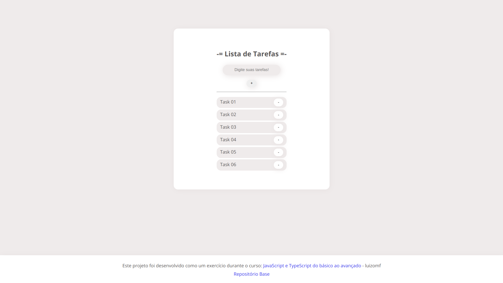

# Basic Task List

## Descrição
Uma simples lista de tarefas que contém funções de adicionar/remover tarefas e mante-las salvas no browser. Esse projeto foi desenvolvido durante o curso [JavaScript e TypeScript do básico ao avançado](https://www.udemy.com/course/curso-de-javascript-moderno-do-basico-ao-avancado/learn/lecture/16342392?start=0#overview), do professor Luiz Otávio Miranda.

## Repositório Pai
https://github.com/alemobn/study-javascript-luizomf